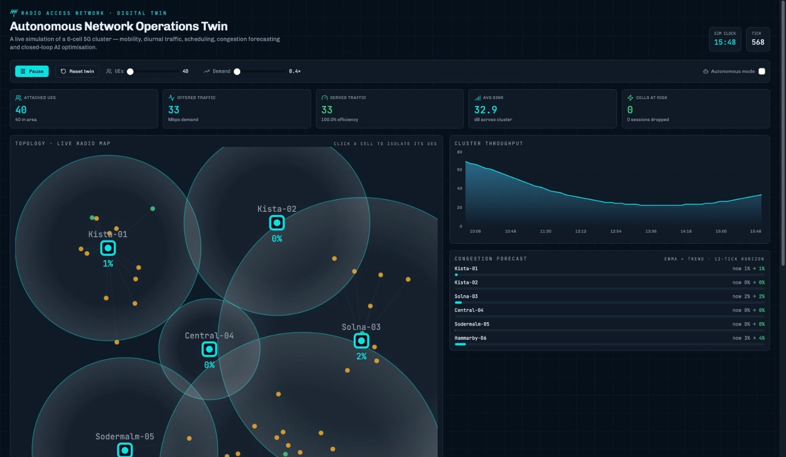

# NetworkTwinPro



## AI-Powered RAN Digital Twin for 5G/6G Networks

NetworkTwinPro is a real-time Radio Access Network (RAN) Digital Twin that simulates a multi-cell 5G network environment. The platform visualizes user mobility, traffic demand, network congestion, throughput trends, and autonomous optimization decisions through an interactive operations dashboard.

---

## Dashboard Preview

The dashboard provides:

- Live 5G cell cluster visualization
- User mobility simulation
- Traffic demand generation
- Throughput monitoring
- Congestion forecasting
- Autonomous network optimization
- Real-time KPI monitoring
- Interactive network analytics

---

## Features

### Network Topology Simulation
- Multi-cell 5G cluster
- Coverage visualization
- Dynamic user distribution
- Cell-level analytics

### Traffic & Mobility Modeling
- User movement simulation
- Traffic demand generation
- Load balancing visualization
- Session tracking

### Congestion Forecasting
- Cell congestion prediction
- Risk analysis
- Trend monitoring
- Capacity insights

### Autonomous Network Operations
- Closed-loop optimization
- AI-driven decision support
- Resource allocation visualization
- Performance monitoring

### Real-Time Dashboard
- Served traffic metrics
- Offered traffic metrics
- Average SINR tracking
- Throughput analytics
- Cells-at-risk monitoring

---

## Technology Stack

### Frontend
- React 19
- TypeScript
- TanStack Start
- TanStack Router
- TanStack Query

### UI & Visualization
- Tailwind CSS
- Radix UI
- Recharts
- Lucide Icons

### Development Tools
- Vite
- ESLint
- Prettier

### Deployment
- Vercel
- Cloudflare Workers

---

## Project Structure

```text
src/
├── assets/
├── components/
├── hooks/
├── lib/
├── routes/
├── router.tsx
├── start.ts
└── server.ts
```

---

## Local Setup

Clone the repository:

```bash
git clone https://github.com/cherry1027/NetworkTwinPro.git
cd NetworkTwinPro
```

Install dependencies:

```bash
npm install
```

Run locally:

```bash
npm run dev
```

Build production version:

```bash
npm run build
```

---

## Future Enhancements

- AI-powered traffic forecasting
- Reinforcement Learning optimization
- Open RAN integration
- Network slicing simulation
- Digital Twin synchronization
- 6G scenario modeling
- Cloud-native deployment

---

## Author

**Sri Charan Varanasi**

Master's Student – Software Engineering  
Blekinge Institute of Technology, Sweden

GitHub: https://github.com/cherry1027

---

## License

MIT License
